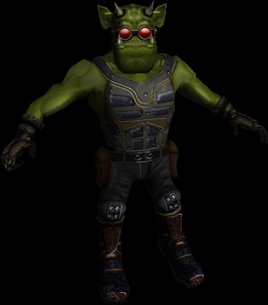

# IQM Demo application

Reference implementation for animating and rendering the IQM format (Inter-Quake Model).

The application contains sample code for loading and using the IQM format.
It is based on OpenGL and provides the following features:
- IQM parsing
- skeletal animation
- model rendering

_References_:  
The official IQM website: http://sauerbraten.org/iqm/  
The official C++ source and reference implementation:  
https://github.com/lsalzman/iqm

In regard to the licensing of the included model (copied from the official IQM source):  
The "mrfixit.iqm" model (and "Head.tga"/"Body.tga" skins) is subject to the following license:  
Mr. Fixit conceptualized, modeled and animated by geartrooper a.k.a. John Siar ironantknight@gmail.com  
Mr. Fixit textures, normal maps and displacement by Acord a.k.a Anthony Cord tonycord@gmail.com mask textures by Nieb  
Mr. Fixit is released under the CC-BY-NC (Creative Commons Attribution Non-Commercial) license. See http://creativecommons.org/licenses/by-nc/3.0/legalcode for more info. Please contact Geartrooper for permission for uses not within the scope of this license.
